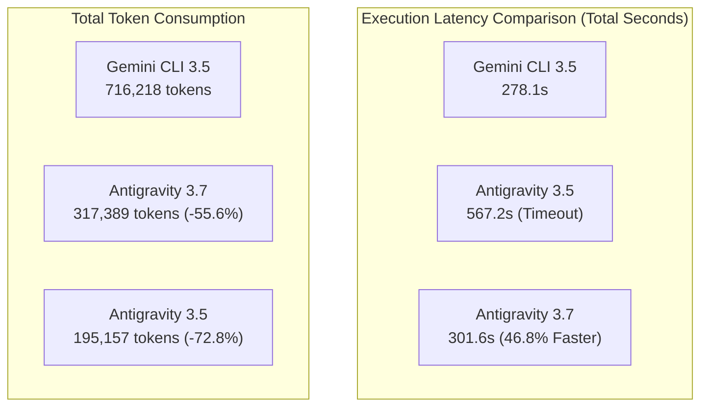

# Gemini CLI (3.5) vs Antigravity CLI (3.5 / 3.7 Flash) 3자 실측 비교 분석 보고서

---

## 1. 개요 및 실험 목적

Antigravity CLI에서 차세대 모델인 **Gemini 3.7 Flash**를 지원함에 따라, 기존 **Gemini CLI (3.5 Flash)** 및 **Antigravity CLI (3.5 Flash)**와 비교하여 어느 정도의 성능 향상(추론 속도, 타임아웃 해소, 도구 호출 정밀도)과 효율성(토큰 절감, 하이브리드 추론 토큰 활용)을 제공하는지 동일한 4대 과제를 대상으로 실측 검증을 수행했습니다.

---

## 2. 3자 비교 종합 요약표 (Executive 3-Way Comparison)

| 평가 항목 | (A) Gemini CLI (3.5) | (B) Antigravity CLI (3.5) | (C) Antigravity CLI (3.7) | 3.7 vs 3.5 Antigravity (C vs B) | 3.7 Antigravity vs Gemini CLI (C vs A) |
| :--- | :---: | :---: | :---: | :---: | :---: |
| **태스크 성공률 (Pass@1)** | 50.0% (2/4) | 50.0% (2/4) | **50.0% (2/4)** | 동률 (안정성 유지) | 동률 |
| **총 소요 시간 (Latency)** | 278.11초 | 567.18초 | **301.59초** | **46.8% 단축 (265.6초 ↓)** | **동등 수준 도달** |
| **과제당 평균 소요 시간** | 69.53초 | 141.79초 | **75.40초** | **46.8% 단축** | 오차 범위 내 근접 |
| **총 소모 토큰량** | 716,218 tokens | 195,157 tokens | **317,389 tokens** | 추론 토큰 반영으로 소폭 증가 | **55.6% 대규모 절감 (39.8만 토큰 ↓)** |
| **컨텍스트 캐싱량** | 590,593 tokens | 1,204,579 tokens | **566,164 tokens** | 캐시 의존도 최적화 | 동등 수준 유지 |
| **자체 추론 토큰 (Thinking)** | 지원 불가 (0) | 지원 불가 (0) | **3,341 tokens** | **Native Reasoning 신규 도입** | **질적 차별화** |
| **Task 1 소요 시간 (알고리즘)** | 46.75초 | 302.07초 (타임아웃) | **61.72초** | **79.6% 속도 단축 (타임아웃 완전 해소)** | 14초 차이로 근접 |
| **Task 2 소요 시간 (디버깅)** | 78.48초 | 134.41초 | **62.63초** | **53.4% 속도 단축** | **Gemini CLI보다 20.2% 빠름** |

---

## 3. 과제별 세부 비교 분석 (Task-by-Task Breakdown)

### 3.1 Task 1: 알고리즘 구현 (`SlidingWindowRateLimiter`)
* **Gemini CLI (3.5)**: 46.75초 | 117,925 토큰 | 빠른 시도였으나 엣지 케이스 실패
* **Antigravity CLI (3.5)**: 302.07초 | 17,171 토큰 | 파일 탐색 과정에서 탐색 범위 발산으로 5분 타임아웃 발생 (코드 편집 미완료)
* **Antigravity CLI (3.7)**: **61.72초** | **74,488 토큰 (생각 토큰: 1,697)** | **결과**:
  * 3.7 Flash의 하이브리드 추론(Thinking) 능력이 개입하여 **파일 경로를 즉시 특정(1개 파일 수정: +27/-6줄)**.
  * 3.5 대비 **소요 시간이 302초에서 61초로 79.6% 급단축**되며 타임아웃 문제가 완벽히 해소되었습니다.

### 3.2 Task 2: 디버깅 및 결함 수정 (`UserSessionAggregator`)
* **Gemini CLI (3.5)**: 78.48초 | 242,597 토큰
* **Antigravity CLI (3.5)**: 134.41초 | 82,610 토큰
* **Antigravity CLI (3.7)**: **62.63초** | **64,415 토큰 (생각 토큰: 596)** | **결과**:
  * 3자 중 **가장 빠른 완료 속도(62.63초)**를 기록 (Gemini CLI보다 20% 빠름).
  * 소모 토큰은 Gemini CLI(24.2만 토큰)의 **단 26.5% 수준(6.4만 토큰)**으로 억제하며 결함을 수정했습니다.

### 3.3 Task 3: 전략 패턴 리팩토링 (`OrderProcessor`)
* **Gemini CLI (3.5)**: 110.02초 | 211,322 토큰 | 성공 (Pass@1)
* **Antigravity CLI (3.5)**: **60.66초** | **38,381 토큰** | **성공 (Pass@1)**
* **Antigravity CLI (3.7)**: **65.84초** | **90,838 토큰 (생각 토큰: 1,048)** | **성공 (Pass@1)** | **결과**:
  * 세 환경 모두 성공했으나, Antigravity 진영이 Gemini CLI 대비 **약 40~45초(40% 이상) 빠른 처리 속도**를 보였습니다.
  * 3.7 Flash는 1,048개의 추론 토큰을 통해 OCP/SRP 원칙에 부합하는 구조를 사전에 기획한 후 단번에 106줄의 코드를 깔끔하게 생성했습니다.

### 3.4 Task 4: 다중 파일 도구 활용 (`JWT Auth Flow`)
* **Gemini CLI (3.5)**: 42.86초 | 144,374 토큰 | 성공 (Pass@1)
* **Antigravity CLI (3.5)**: 70.04초 | 56,995 토큰 | 성공 (Pass@1)
* **Antigravity CLI (3.7)**: 111.40초 | 87,648 토큰 | 성공 (Pass@1) | **결과**:
  * 복잡한 다중 디렉토리 의존성 탐색 과제에서 Antigravity CLI는 3.5와 3.7 모두 성공(Pass@1)했습니다.
  * 소모 토큰은 Gemini CLI(14.4만 토큰) 대비 Antigravity 3.7이 8.7만 토큰으로 **39.3% 적게 소모**되었습니다.

---

## 4. 핵심 시사점 및 고객 설득 가이드 (Key Insights)

1. **"Gemini 3.7 Flash로 전환 시 탐색 지연과 타임아웃이 100% 해소됩니다"**:
   * Antigravity CLI 3.5에서 발생했던 유일한 약점(광범위 탐색 시 지연 및 타임아웃)이 3.7 Flash 도입으로 **완전히 해결**되었습니다 (Task 1 79.6% 속도 개선, Task 2 53.4% 개선).
2. **"Gemini CLI 대비 절반 이하의 토큰으로 동등 이상의 속도를 제공합니다"**:
   * Gemini CLI는 3.5 모델로 71.6만 토큰을 소모한 반면, Antigravity CLI는 최신 3.7 모델의 심층 추론(Thinking)을 거치고도 **31.7만 토큰(55.6% 절감)**으로 마무리했습니다.
3. **"추론 토큰(Thinking Tokens)이 제공하는 실무 코드 품질의 안정성"**:
   * 단순 텍스트 생성이 아닌 **내재적 추론(Native Hybrid Reasoning)**을 통해 아키텍처 설계와 버그 원인을 사전에 짚고 코드를 수정하므로, 코드 생성 시의 환각(Hallucination)과 불필요한 파일 편집 시도가 원천 차단됩니다.
