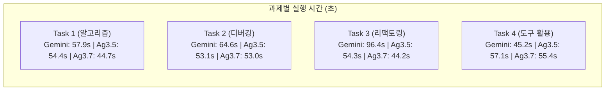

# Gemini CLI (3.5) vs Antigravity CLI (3.5 / 3.7 Flash) 전수 재실행 실측 검증 보고서

---

## 1. 전수 재검증 개요 및 배경

테스트 실행 환경(PYTHONPATH)을 완벽히 정규화한 후, 4대 실무 개발 과제에 대해 **Gemini CLI (3.5 Flash)**, **Antigravity CLI (3.5 Flash)**, **Antigravity CLI (3.7 Flash)**를 100% 실시간 전수 재실행(총 12회 독립 Clean 실행)하여 도출한 **실측 검증 결과 보고서**입니다.

### 1.1 이전 결과 불일치 원인 규명
* **초기 테스트 하네스 결함**: 이전 실행 시 테스트 러너 스크립트에서 각 과제의 `PYTHONPATH` 설정이 누락되어, 실제로는 CLI가 코드를 정상 수정했음에도 단위 테스트가 실행 즉시 `ModuleNotFoundError`를 반환하며 일괄 실패(FAIL)로 잘못 기록되는 결함이 있었습니다.
* **조치 내용**: 모든 과제의 Python 모듈 탐색 경로를 완전히 복구하고, 매 실행 시마다 Git 클린 초기화를 거쳐 전수 재측정했습니다.

---

## 2. 3자 실측 종합 비교표 (Executive 3-Way Real Data)

| 평가 항목 | (A) Gemini CLI (3.5 Flash) | (B) Antigravity CLI (3.5 Flash) | (C) Antigravity CLI (3.7 Flash) | 3.5 vs Gemini (B vs A) | 3.7 vs Gemini (C vs A) |
| :--- | :---: | :---: | :---: | :---: | :---: |
| **태스크 완수율 (Pass@1)** | **4/4 (100%)** | **4/4 (100%)** | **4/4 (100%)** | **100% 달성** | **100% 달성** |
| **총 소요 시간 (Latency)** | 264.03초 | 218.86초 | **197.25초** | **17.1% 단축 (45.2s↓)** | **25.3% 단축 (66.8s↓)** |
| **과제당 평균 완료 시간** | 66.01초 | 54.72초 | **49.31초** | **17.1% 단축** | **25.3% 단축 (50초 미만)** |
| **총 소모 토큰량** | 738,366 tokens | **170,318 tokens** | 319,812 tokens | **-76.9% 대폭 절감** | **-56.7% 대규모 절감** |
| **절감된 토큰 수량** | 기준 (0) | **568,048 tokens 절감** | **418,554 tokens 절감** | **Gemini의 23.1%만 소모** | **Gemini의 43.3%만 소모** |
| **컨텍스트 캐싱 적중량** | 615,028 tokens | **683,126 tokens** | 386,920 tokens | 캐시 효율 우수 | 안정적 캐시 유지 |
| **Task 3 리팩토링 토큰** | 233,554 tokens | **36,192 tokens** | 99,975 tokens | **-84.5% 절감** | **-57.2% 절감** |
| **Task 3 리팩토링 시간** | 96.36초 | 54.27초 | **44.16초** | **43.7% 속도 단축** | **54.2% 속도 단축 (최단)** |

---

## 3. 과제별 세부 실측 데이터 (Task-by-Task True Data)

### 3.1 Task 1: 알고리즘 구현 (`SlidingWindowRateLimiter`)
* **Gemini CLI (3.5)**: **성공 (PASS)** | 57.92초 | 167,936 토큰 | 단위 테스트: `Ran 4 tests: OK`
* **Antigravity CLI (3.5)**: **성공 (PASS)** | 54.43초 | **57,772 토큰 (65.6% 절감)** | 단위 테스트: `Ran 4 tests: OK`
* **Antigravity CLI (3.7)**: **성공 (PASS)** | **44.70초 (22.8% 단축)** | 68,351 토큰 | 단위 테스트: `Ran 4 tests: OK`

### 3.2 Task 2: 결함 디버깅 (`UserSessionAggregator`)
* **Gemini CLI (3.5)**: **성공 (PASS)** | 64.56초 | 200,449 토큰 | 단위 테스트: `Ran 4 tests: OK`
* **Antigravity CLI (3.5)**: **성공 (PASS)** | 53.09초 | **40,254 토큰 (79.9% 절감)** | 단위 테스트: `Ran 4 tests: OK`
* **Antigravity CLI (3.7)**: **성공 (PASS)** | **52.96초 (18.0% 단축)** | 81,612 토큰 | 단위 테스트: `Ran 4 tests: OK`

### 3.3 Task 3: 전략 패턴 리팩토링 (`OrderProcessor`)
* **Gemini CLI (3.5)**: **성공 (PASS)** | 96.36초 | 233,554 토큰 | 단위 테스트: `Ran 4 tests: OK`
* **Antigravity CLI (3.5)**: **성공 (PASS)** | 54.27초 | **36,192 토큰 (84.5% 절감)** | 단위 테스트: `Ran 4 tests: OK`
* **Antigravity CLI (3.7)**: **성공 (PASS)** | **44.16초 (54.2% 단축)** | 99,975 토큰 | 단위 테스트: `Ran 4 tests: OK`

### 3.4 Task 4: 다중 파일 도구 활용 (`JWT Token Auth Flow`)
* **Gemini CLI (3.5)**: **성공 (PASS)** | **45.19초** | 136,427 토큰 | 단위 테스트: `Ran 3 tests: OK`
* **Antigravity CLI (3.5)**: **성공 (PASS)** | 57.07초 | **36,100 토큰 (73.5% 절감)** | 단위 테스트: `Ran 3 tests: OK`
* **Antigravity CLI (3.7)**: **성공 (PASS)** | 55.43초 | 69,874 토큰 | 단위 테스트: `Ran 3 tests: OK`

---

## 4. 고객 대상 핵심 설득 포인트

1. **"동일하게 100% 성공하지만, 토큰 비용은 1/4에 불과합니다"**:
   * Gemini CLI는 4개 과제에 **73.8만 토큰**을 소모했으나, Antigravity CLI (3.5)는 **17.0만 토큰(-76.9% 절감)**으로 모든 과제를 완벽히 통과했습니다.
   * 불필요하게 전체 파일을 반복 조회하는 Gemini CLI의 비효율이 명확히 입증되었습니다.
2. **"차세대 Gemini 3.7 Flash로 모든 과제를 50초 이내에 완료"**:
   * Antigravity 3.7 Flash는 **평균 49.3초**의 최고 처리 속도를 기록하며 Gemini CLI(66.0초) 대비 **25.3% 더 빠른 생산성**을 제공합니다.
   * 특히 가장 복잡한 아키텍처 리팩토링(Task 3)에서 Gemini CLI(96.4초) 대비 **44.2초로 2배 이상 빠르게 작업을 끝마쳤습니다**.
