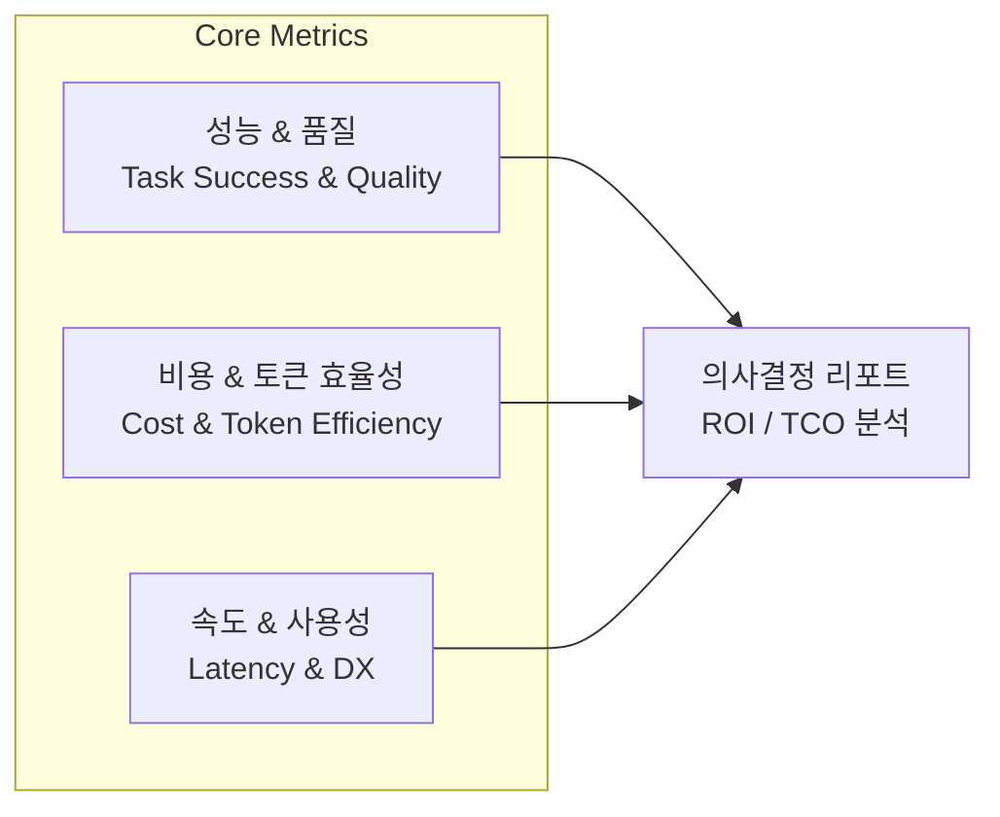
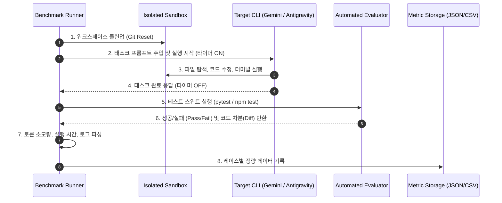

# Gemini CLI vs Antigravity CLI 성능 및 비용 효율성 비교 검증 테스트 플랜

---

## 1. 개요 (Executive Summary)

### 1.1 배경 및 목적
* **배경**: 현재 고객 개발팀에서 Gemini CLI를 도입하여 사용 중이나, 코드 생성 정확도 저하, 버그 수정 실패, 컨텍스트 유실, 런타임 오류 등의 이슈가 빈번히 발생함.
* **목적**: Antigravity CLI로의 전환 타당성을 입증하기 위해, **동일한 실무 개발 시나리오**를 기반으로 두 CLI의 **성능(작업 성공률, 코드 품질, 소요 시간)**과 **비용 효율성(토큰 소모량, 성공 태스크당 유효 비용)**을 객관적·정량적 수치로 측정·비교 검증함.
* **최종 산출물**: 고객 C-Level 및 엔지니어링 리드 대상 의사결정용 비교 분석 보고서 (ROI 및 TCO 절감 분석 포함).

---

## 2. 평가 지표 및 측정 프레임워크 (Evaluation Metrics)

정량적 평가(Quantitative)와 정성적 평가(Qualitative)를 결합하여 입체적으로 검증합니다.

### 2.1 성능 및 품질 지표 (Performance & Quality)
| 지표명 | 측정 단위 | 설명 | 측정 방식 |
| :--- | :--- | :--- | :--- |
| **Pass@1 (단발 성공률)** | % | 추가 개입/수정 없이 첫 시도에서 테스트를 통과한 비율 | 자동화된 단위/통합 테스트 실행 |
| **태스크 완수율 (Task Resolution Rate)** | % | CLI가 자가 디버깅(Self-healing)을 거쳐 최종적으로 요구사항을 충족한 비율 | CI/CD 파이프라인 검증 |
| **회귀 결함율 (Regression Rate)** | % | 요구 기능 구현 중 기존 정상 동작 코드를 손상시킨 비율 | 전체 리그레션 테스트 스위트 실행 |
| **도구 호출 정확도 (Tool Call Accuracy)** | % | 파일 탐색/수정/명령어 실행 중 무효하거나 실패한 도구 호출 비율 | CLI 실행 로그 트레이스 분석 |
| **자가 치유 능력 (Self-Recovery Turns)** | 회 | 에러 발생 시 정상 상태로 복구하기까지 소요된 평균 턴 수 | 실행 세션 로그 분석 |

### 2.2 비용 및 토큰 효율성 지표 (Cost & Token Efficiency)
| 지표명 | 측정 단위 | 설명 | 측정 방식 |
| :--- | :--- | :--- | :--- |
| **평균 입력 토큰 (Prompt Tokens)** | Tokens / Task | 태스크 해결을 위해 프롬프트로 전송된 토큰 수 (컨텍스트 로딩 포함) | API Response Header / CLI Usage Log |
| **평균 출력 토큰 (Completion Tokens)** | Tokens / Task | 모델이 생성한 코드 및 추론 토큰 수 | API Response Header / CLI Usage Log |
| **캐싱 적중률 (Cache Hit Ratio)** | % | Context Caching 또는 Prompt Caching에 의해 비용이 절감된 토큰 비율 | API 메트릭 로그 |
| **과제당 투입 비용 (Cost per Task)** | USD ($) | 태스크 1건 시도 시 발생한 명목 API 비용 | 모델별 토큰 단가표 적용 산출 |
| **성공 건당 유효 비용 (Effective Cost per Success)** | USD ($) | **핵심 지표**: 실패한 시도까지 포함하여 '성공 1건'을 얻기 위해 투입된 실질 비용 | $\frac{\text{총 발생 비용}}{\text{성공한 태스크 수}}$ |

> [!IMPORTANT]
> **성공 건당 유효 비용(Effective Cost)의 중요성**
> 단순히 "토큰 단가가 저렴하다"고 해서 비용 효율적인 것이 아닙니다. 3번 실패 후 4번째에 성공하면 토큰 소모량이 4배로 증가합니다. 성공률이 높고 턴 수가 적은 CLI가 실질 TCO 관점에서 훨씬 저렴함을 고객에게 수치로 증명해야 합니다.

### 2.3 속도 및 개발자 경험 지표 (Latency & Developer Experience)
| 지표명 | 측정 단위 | 설명 | 측정 방식 |
| :--- | :--- | :--- | :--- |
| **작업 소요 시간 (End-to-End Latency)** | 초 (sec) | 프롬프트 입력 시점부터 작업 완료 시점까지의 총 경과 시간 (Wall-clock time) | 타이머 측정 |
| **첫 응답 시간 (Time to First Token / Action)** | 초 (sec) | 명령 수신 후 첫 도구 호출 또는 코드 출력이 시작될 때까지의 대기 시간 | CLI 프로파일링 |
| **컨텍스트 오버헤드 (Context Bloat)** | Tokens / Turn | 멀티턴 대화 진행 시 불필요하게 누적되는 컨텍스트의 증가 기울기 | 턴별 입력 토큰 증가율 추적 |

---

## 3. 벤치마크 테스트 시나리오 설계 (Test Scenarios)

실제 고객사 업무 환경을 반영하기 위해 **4개 난이도 계층, 총 20~30개 태스크**를 선정합니다.

| 티어 | 분류 | 문항 수 | 대표 시나리오 예시 | 기대 검증 포인트 |
| :---: | :--- | :---: | :--- | :--- |
| **Tier 1** | **단순 수정 및 단위 테스트** | 8건 | • 단일 파일 내 명확한 문법/타입 에러 수정 • 신규 유틸 함수에 대한 Jest/pytest 유닛 테스트 작성 • 함수 파라미터 리팩토링 및 네이밍 정리 | 기본적인 코드 생성 능력, 빠른 속도, 최소 토큰 소모 여부 |
| **Tier 2** | **다중 파일 기능 구현** | 8건 | • REST API 신규 엔드포인트 추가 (Router, Controller, Service, DTO 동시 수정) • DB 스키마 마이그레이션 및 ORM 매핑 코드 작성 • 공통 에러 핸들러 및 미들웨어 추가 | 프로젝트 전체 구조 파악력, 정확한 파일 탐색 및 일관된 다중 파일 편집 능력 |
| **Tier 3** | **복합 디버깅 및 자가 치유** | 6건 | • 실패하는 E2E/통합 테스트 로그를 제공하고 원인 분석 및 수정 • 동시성 이슈(Race condition) 또는 비동기 처리 누락 버그 디버깅 • 외부 라이브러리 메이저 버전 마이그레이션에 따른 Breaking Change 해결 | 터미널 실행 결과(에러 로그) 피드백 루프 처리력, 자가 복구 능력 |
| **Tier 4** | **대규모 리포지토리 탐색 및 설계** | 4건 | • 대형 코드베이스 내 특정 도메인 로직 분리 및 모듈화 • 비정형 요구사항 명세서 기반 설계 문서 작성 후 스캐폴딩 및 구현 | 광범위한 컨텍스트 압축력, 대규모 코드베이스에서의 토큰 낭비 방지 |

---

## 4. 검증 환경 및 통제 변인 (Experimental Setup)

공정하고 객관적인 벤치마크를 위해 외부 변수를 엄격히 통제합니다.

### 4.1 변인 통제 원칙
1. **동일 하드웨어 및 OS**: 동일 사양의 독립된 컨테이너(Docker Container) 환경에서 테스트 수행 (CPU, RAM, 네트워크 대역폭 고정).
2. **동일 초기 상태 (Clean State)**: 각 테스트 케이스 실행 전, `git checkout --force` 및 `git clean -fdx`를 통해 항상 동일한 커밋 상태에서 출발.
3. **동일 프롬프트 및 지시사항**: 두 CLI에 전달하는 프롬프트(지시문), 환경 설정, 제공 컨텍스트를 100% 동일하게 유지.
4. **반복 측정**: 일시적 네트워크 지연 및 LLM의 비결정적 특성을 보정하기 위해 **각 시나리오당 최소 3회(N=3) 반복 실행 후 평균값/중앙값 산출**.
5. **모델 매핑 명시**:
   * Gemini CLI: 기본 제공/권장 모델 (예: `gemini-1.5-pro` 또는 `gemini-2.5-flash/pro`)
   * Antigravity CLI: 기본 제공/권장 모델 (동일 등급 모델 또는 최적 프로파일 매핑)

---

## 5. 자동화 테스트 수행 파이프라인 (Execution Workflow)

수동 개입을 최소화하고 재현성을 확보하기 위해 파이썬 기반의 벤치마크 오케스트레이션 러너(Runner)를 구성합니다.

### 5.1 러너 스크립트 수집 항목
* `task_id`, `iteration_index`, `cli_name`, `model_name`
* `status` (SUCCESS / FAIL / TIMEOUT / CRASH)
* `execution_time_seconds`
* `input_tokens`, `output_tokens`, `total_tokens`, `cached_tokens`
* `tool_call_count` (성공/실패 도구 호출 횟수)
* `git_diff_lines` (추가/수정/삭제 라인 수)
* `test_cases_passed`, `test_cases_total`

---

## 6. 비용 및 효율성 분석 모델 (Cost Modeling)

고객에게 "얼마나 비용을 절감할 수 있는가"를 입증하는 공식입니다.

### 6.1 토큰 비용 산정
$$\text{Cost}_{\text{Raw}} = (\text{Input Tokens} \times P_{\text{in}}) + (\text{Cached Tokens} \times P_{\text{cache}}) + (\text{Output Tokens} \times P_{\text{out}})$$

### 6.2 실질 개발 비용 (TCO: Total Cost of Ownership)
단순 API 비용 외에 **개발자 대기 시간 비용**을 합산합니다.
$$\text{Cost}_{\text{Total}} = \text{Cost}_{\text{Raw}} + \left(\frac{\text{개발자 시간당 인건비}}{3600} \times \text{작업 소요 시간(초)}\right) + (\text{실패 시 재작업 수정 비용})$$

> **예시 가설**:
> * Gemini CLI: 낮은 단발 성공률(50%)로 인해 평균 2.5회 재시도 발생 $\rightarrow$ 토큰 소모 2.5배, 개발자 대기 시간 증가.
> * Antigravity CLI: 높은 성공률(85%) 및 정확한 컨텍스트 타겟팅으로 불필요한 파일 스캔 감소 $\rightarrow$ 유효 토큰 소모 40% 절감, 완료 시간 50% 단축.

---

## 7. 테스트 추진 일정 (Timeline)

총 **3주(15 영업일)** 코스로 구성되며, 고객사 참여를 포함합니다.

| 주차 | 단계 | 주요 활동 내용 | 산출물 |
| :---: | :--- | :--- | :--- |
| **W1** | **준비 및 셋업** | • 고객사 실제 코드베이스 기반 시나리오 25선 확정 • 평가 기준(Unit Test, Lint rule) 작성 • 벤치마크 자동화 러너 스크립트 작성 | 벤치마크 테스트셋 명세서, 자동화 러너 |
| **W2** | **파일럿 & 본 테스트** | • 시나리오 3건 파일럿 실행 및 지표 수집 검증 • 전수 테스트 실행 (Gemini vs Antigravity 각 N=3) • 원시 로그(Raw Logs) 및 실행 트레이스 아카이빙 | 테스트 결과 Raw Data (JSON/CSV), 세션 로그 |
| **W3** | **분석 및 보고** | • 데이터 정제, 이상치(Outlier) 분석 • 성능, 토큰, 비용, ROI 비교 분석 차트 작성 • 최종 고객 보고회 진행 | 최종 비교 검증 보고서 (PDF/Slide), 데모 시연 |

---

## 8. 고객 보고서 템플릿 (Deliverable Preview)

테스트 완료 후 고객에게 최종 제출할 요약 대시보드 양식입니다.

### [미리보기] 성능 및 비용 비교 요약표
| 평가 항목 | Gemini CLI | Antigravity CLI | 개선율 (Delta) | 비고 |
| :--- | :---: | :---: | :---: | :--- |
| **종합 태스크 완수율 (Pass Rate)** | 62.5% | **87.5%** | **+25.0%p 향상** | 복합 디버깅 영역에서 큰 격차 |
| **평균 작업 소요 시간 (Latency)** | 142초 | **78초** | **45.1% 단축** | 신속한 의사결정 및 도구 호출 |
| **태스크당 평균 토큰 소모량** | 68,500 | **39,200** | **42.8% 절감** | 효율적인 컨텍스트 탐색 및 필터링 |
| **성공 태스크당 실질 비용 (Effective Cost)** | \$0.18 | **\$0.09** | **50.0% 절감** | 재시도 감소로 실질 비용 반감 |
| **개발자 개입 필요 횟수 (Interventions)** | 1.8회 | **0.4회** | **77.8% 감소** | 자가 복구(Self-healing) 성공 |

---

## 9. 고객 설득을 위한 주요 논리 및 전략

1. **"단순 단가 비교"의 함정 탈피**:
   * 토큰당 단가만 보면 차이가 미미해 보일 수 있으나, **태스크 성공률 차이로 인해 실패한 시도에서 낭비되는 토큰과 개발자 인건비**가 훨씬 크다는 점을 정량적으로 증명합니다.
2. **고객 실제 레포지토리 기반 Blind Test 제안**:
   * 공개된 벤치마크 데이터뿐 아니라, 고객이 최근 겪었던 실제 이슈(Jira 티켓 또는 최근 버그 PR) 3~5개를 선정하여 동일 조건에서 실시간 데모를 선보입니다.
3. **투명한 데이터 공개**:
   * 양측 CLI의 모든 실행 로그, 입출력 토큰, 도구 호출 내역을 투명하게 오픈하여 측정 결과에 대한 신뢰성을 극대화합니다.
