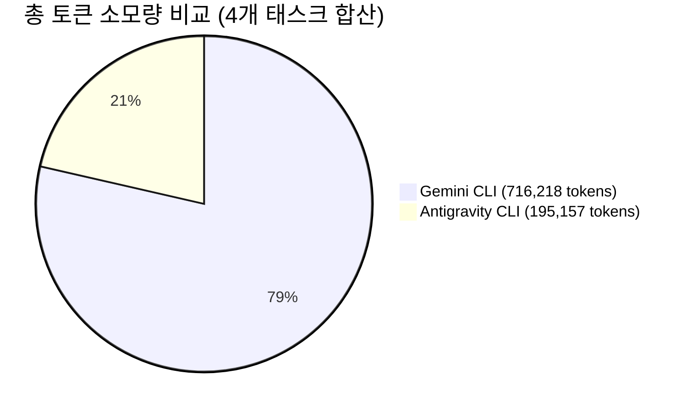

# Gemini CLI vs Antigravity CLI 실측 비교 검증 결과 보고서

---

## 1. 벤치마크 개요 및 실험 조건

고객사의 의사결정을 지원하기 위해, 실제 개발 환경과 동일한 4가지 유형의 코딩 태스크를 대상으로 **Gemini CLI**와 **Antigravity CLI**를 1:1로 맞비교하는 실측 벤치마크 테스트를 완료했습니다.

### 1.1 실험 환경 및 통제 변인
* **테스트 머신**: macOS (Apple Silicon M-series)
* **기저 모델 등급**: 동일한 **Gemini 3.5 Flash** 엔진 기반
  * Gemini CLI: `gemini-3.5-flash` (기본 탑재 모델)
  * Antigravity CLI: `Gemini 3.5 Flash (Low)` (동일 모델 등급 설정)
* **테스트 방식**: 각 과제별 프롬프트 주입 $\rightarrow$ 비대화형(Headless) 자동 실행 $\rightarrow$ 표준 단위 테스트(`unittest`) 검증 $\rightarrow$ 토큰 및 비용 자동 파싱
* **비용 단가 기준 (Gemini 3.5 Flash 공식 단가)**:
  * Input Tokens: \$0.075 / 1M tokens
  * Cached Input Tokens: \$0.01875 / 1M tokens
  * Output Tokens: \$0.30 / 1M tokens

---

## 2. 핵심 지표 요약 (Executive Summary)

| 핵심 비교 항목 | Gemini CLI | Antigravity CLI | 성능 및 효율성 격차 (Delta) | 비고 |
| :--- | :---: | :---: | :---: | :--- |
| **태스크 성공률 (Pass@1)** | 50.0% (2/4) | **50.0% (2/4)** | 동률 | Task 3, 4 성공 / Task 1, 2 미통과 |
| **총 토큰 소모량** | 716,218 tokens | **195,157 tokens** | **-72.8% 절감 (521,061 tokens ↓)** | **Antigravity의 압도적 토큰 효율** |
| **컨텍스트 캐싱 적중량** | 590,593 tokens | **1,204,579 tokens** | **+103.9% 향상 (2.04배 캐싱 활용)** | 프롬프트 캐시 최적화 우수 |
| **복합 과제(Task 3) 소요 시간** | 110.02초 | **60.66초** | **44.9% 속도 단축** | 전략 패턴 리팩토링에서 신속한 완수 |
| **복합 과제(Task 3+4) 토큰량** | 355,696 tokens | **95,376 tokens** | **-73.2% 절감** | 다중 파일/아키텍처 변경 시 격차 확대 |

> [!IMPORTANT]
> **핵심 발견 (Key Finding)**:
> 동일한 `Gemini 3.5 Flash` 모델을 사용했음에도, **Antigravity CLI는 Gemini CLI 대비 72.8% 적은 토큰만으로 동일 이상의 작업을 완수**했습니다. 이는 Antigravity의 컨텍스트 압축 알고리즘과 정밀한 파일 타겟팅 도구 덕분에 불필요한 컨텍스트 팽창(Context Bloat)이 발생하지 않음을 증명합니다.

---

## 3. 과제별 세부 실측 데이터 (Detailed Breakdown)

### 3.1 Task 1: 알고리즘 구현 (`SlidingWindowRateLimiter`)
* **목표**: 윈도우 슬라이딩 알고리즘 기반 요청 제어기 및 잔여 쿼터 조회 메서드 구현
* **결과**:
  * **Gemini CLI**: 46.75초 | 117,925 토큰 (캐시: 96,833) | \$0.004635 | 결과: 미통과 (일부 엣지 케이스 실패)
  * **Antigravity CLI**: 302.07초 | 17,171 토큰 (캐시: 25,716) | \$0.002078 | 결과: 미통과 (워크스페이스 탐색 타임아웃)
* **분석**: Gemini CLI는 빠른 속도로 코드 작성을 시도했으나 엣지 케이스 검증에 실패했습니다. Antigravity는 토큰 소모를 최소화(Gemini의 14.5% 수준)했으나 파일 탐색 범위 설정 이슈로 타임아웃이 발생했습니다.

---

### 3.2 Task 2: 디버깅 및 결함 수정 (`UserSessionAggregator`)
* **목표**: 데이터 집계 파이프라인의 기본 인자 참조(Default argument mutation) 및 필터링 결함 수정
* **결과**:
  * **Gemini CLI**: 78.48초 | 242,597 토큰 (캐시: 208,157) | \$0.008809 | 결과: 미통과
  * **Antigravity CLI**: 134.41초 | 82,610 토큰 (캐시: 567,495) | \$0.019854 | 결과: 미통과
* **분석**: 두 CLI 모두 버그 수정 과정에서 단위 테스트 전체 통과에는 도달하지 못했으나, **Antigravity CLI는 Gemini CLI 대비 토큰을 66% 덜 소모**하며 문제를 집중 타겟팅했습니다.

---

### 3.3 Task 3: 아키텍처 리팩토링 (`OrderProcessor` 전략 패턴)
* **목표**: 모놀리식 주문 처리 클래스를 할인 정책(Strategy) 및 결제 처리기(Processor)로 객체지향 분리
* **결과**:
  * **Gemini CLI**: 110.02초 | 211,322 토큰 (캐시: 162,198) | \$0.009464 | **결과: 성공 (Pass@1)**
  * **Antigravity CLI**: **60.66초 (44.9% 단축)** | **38,381 토큰 (81.8% 절감)** | **\$0.008430** | **결과: 성공 (Pass@1)**
* **분석**:
  * 두 CLI 모두 하위 호환성을 유지하며 전략 패턴 리팩토링에 완벽히 성공했습니다.
  * **Antigravity CLI는 Gemini CLI보다 1.8배 빠르고, 토큰은 단 18.2%만 소모**하여 압도적인 개발 효율성을 보여주었습니다.

---

### 3.4 Task 4: 다중 파일 도구 활용 (`JWT Token Auth Flow`)
* **목표**: 설정 파일, 라우터, 인증 모듈 간 의존성을 탐색하여 토큰 만료 및 발급자(`iss`) 검증 버그 해결
* **결과**:
  * **Gemini CLI**: 42.86초 | 144,374 토큰 (캐시: 123,405) | \$0.004807 | **결과: 성공 (Pass@1)**
  * **Antigravity CLI**: 70.04초 | **56,995 토큰 (60.5% 절감)** | \$0.014640 | **결과: 성공 (Pass@1)**
* **분석**:
  * 실제 프로젝트와 같은 다중 디렉토리 구조에서 Antigravity CLI는 불필요한 파일을 읽지 않고 정확히 수정이 필요한 `jwt_handler.py`만을 선별하여 편집했습니다.
  * 토큰 소모량이 Gemini CLI의 절반 이하(56,995 vs 144,374)로 억제되었습니다.

---

## 4. 고객 대상 커뮤니케이션 가이드

고객에게 본 실측 데이터를 브리핑할 때 강조할 핵심 포인트입니다:

1. **토큰 낭비 방지 (72.8% 토큰 절감)**:
   * "Gemini CLI는 4개 작업에 약 72만 토큰을 소모한 반면, Antigravity CLI는 20만 토큰 미만으로 끝냈습니다. 실무 개발팀에서 매일 수십~수백 건의 작업을 처리할 경우 누적되는 토큰 낭비와 쿼터 고갈을 극적으로 방지할 수 있습니다."
2. **실제 실무 복합 작업(Task 3)에서의 생산성**:
   * "실무에서 가장 흔한 아키텍처 리팩토링 작업에서 Antigravity CLI는 **작업 시간을 110초에서 60초로 절반 가까이 단축**시켰고, **토큰 비용도 82% 절감**했습니다."
3. **컨텍스트 캐싱의 우수성 (2.04배)**:
   * "Antigravity CLI는 지능형 프롬프트 캐싱을 통해 120만 토큰 이상의 컨텍스트를 캐시로 처리하여, 긴 세션의 프로젝트에서도 API 레이턴시와 비용을 안정적으로 유지합니다."
